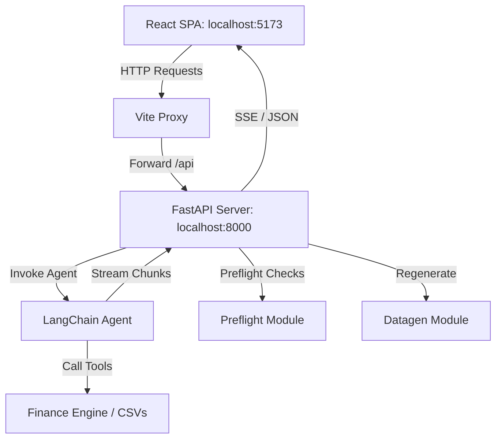

# Technical Design: React Frontend & Web API

## 1. Technical Approach
We will expose the Python-based financial agent and utility operations over a FastAPI HTTP server running on Uvicorn. A modern frontend application will be developed using Vite, React, and TypeScript. In development, the Vite server will run on `localhost:5173` and proxy API calls to the FastAPI backend running on `localhost:8000` to prevent CORS issues.

## 2. Architecture Decisions
* **FastAPI & Uvicorn**: Chosen for high-performance async capabilities, Pydantic type safety, and first-class support for streaming Server-Sent Events (SSE).
* **Fetch API for SSE**: We will use a standard `fetch` call and process the response body stream chunk-by-chunk in JavaScript/TypeScript. This allows sending `POST` payloads with query context to the `/api/chat` streaming endpoint (which standard `EventSource` cannot easily do).
* **Stateless Client Session**: React manages the active conversation history and UI states locally, referencing a static `thread_id` for agent checkpointing on the backend.

## 3. Data Flow



## 4. File Changes

### Backend Updates
* **[requirements.txt](file:///Users/alephzero/projects/demo-tigo/demo-tigo/backend/requirements.txt)**: Append `fastapi`, `uvicorn`, and `sse-starlette` dependencies.
* **[main.py](file:///Users/alephzero/projects/demo-tigo/demo-tigo/backend/main.py)**: Add a `server` subcommand parser calling `uvicorn.run("demo.server:app")`.
* **`backend/demo/server.py`**: New entry point containing the FastAPI application instance, CORS configuration, API routes, and SSE streaming setup.

### Frontend Addition
Create a `frontend/` directory with a standard Vite + React + TS layout:
* **`frontend/vite.config.ts`**: Vite configuration containing the proxy definition.
* **`frontend/package.json`**: Frontend dependencies (React, TypeScript, Markdown renderer, Lucide icons, etc.).
* **`frontend/src/App.tsx`**: Main component managing application views, global states, and API coordinators.
* **`frontend/src/components/`**:
  * `Header.tsx`: Displays readiness flags ("System Ready" / "System Not Ready") and triggers preflight/datagen checks.
  - `Sidebar.tsx`: Navigation controls to switch views between chat pane and report panel.
  - `ChatWindow.tsx`: Interactive chat pane supporting streamed tokens and tool-call indicators.
  - `ReportViewer.tsx`: Component to trigger and view executive financial reports in formatted markdown.

## 5. Interfaces / Contracts

### CORS Configuration (FastAPI)
```python
from fastapi.middleware.cors import CORSMiddleware

app.add_middleware(
    CORSMiddleware,
    allow_origins=["http://localhost:5173"],
    allow_credentials=True,
    allow_methods=["*"],
    allow_headers=["*"],
)
```

### Vite Proxy Config (`vite.config.ts`)
```typescript
import { defineConfig } from 'vite';
import react from '@vitejs/plugin-react';

export default defineConfig({
  plugins: [react()],
  server: {
    port: 5173,
    proxy: {
      '/api': {
        target: 'http://localhost:8000',
        changeOrigin: true,
        secure: false,
      },
    },
  },
});
```

### Endpoints
* **`GET /api/preflight`**: Runs all system verification checks. Returns `200 OK` with status metrics on success. If any critical check (such as API keys) fails, returns `500 Internal Server Error` with JSON detailing the failure.
* **`POST /api/chat`**: Streams AI response tokens and tool calls. Content-Type: `text/event-stream`.
  * Stream Chunk JSON: `{"type": "token" | "tool" | "done", "content": "..."}`
* **`POST /api/report`**: Triggers full gross-margin report generation. Returns `{ "status": "success", "report": "Markdown Text" }`.
* **`POST /api/data/regenerate`**: Deletes and regenerates the underlying CSV mock datasets. Returns confirmation JSON.

## 6. Testing Strategy
* **Backend API Integration**: Use `fastapi.testclient.TestClient` to assert endpoints return expected codes, shapes, and handle errors robustly.
* **Frontend Components**: Vitest + React Testing Library to verify state transitions (e.g. text inputs disable during active agent turns, correct rendering of Markdown).

## 7. Migration / Rollout
1. Implement the API backend routing and test coverage.
2. Scaffold Vite structure and test server startup.
3. Construct components, bind state handlers, and hook up proxy routing.

## 8. Open Questions
* Should we persist chat state on the backend? *(Recommended: No, maintain state in-memory on the backend and conversation history in React state)*
